# Agentic Website Design Review Workflow

<p align="center">
  <a href="https://github.com/RNT56/design-review-workflow/actions/workflows/ci.yml"></a>
  
  
  
  
</p>

Design Review Workflow turns a public URL into an evidence-backed UX, visual design, conversion, mobile and accessibility-basic review bundle that repo-capable agents can run, inspect and hand off.

It is built for repeatable design critique instead of loose screenshot notes: the workflow captures rendered evidence, extracts page structure, writes validated findings, generates review-pack contact sheets, and keeps business-grade claims gated until the running multimodal agent has actually inspected the screenshots.

## Status

| Item              | State                                                                    |
| ----------------- | ------------------------------------------------------------------------ |
| Current version   | `0.1.0`                                                                  |
| Stability         | Pre-1.0; report lint and business-grade gates enforce the bundle shape   |
| Primary interface | `node apps/cli/dist/index.js run <url>`                                  |
| Agent handoff     | Works with repo-capable agents such as Codex, Claude Code and opencode   |
| Storage           | Local-first under `audit-reports/<site>/<run-id>/`                       |
| License           | Custom non-commercial license; commercial use is prohibited              |

## What It Reviews

| Area                    | Coverage                                                                                                            |
| ----------------------- | ------------------------------------------------------------------------------------------------------------------- |
| First impression        | above-fold hierarchy, immediate comprehension, CTA clarity, visual priority and page intent                         |
| Visual design           | typography, color signals, spacing, radius usage, rhythm, composition and design-system consistency                 |
| UX and navigation       | page classification, navigation clarity, route inventory, link/button/form evidence and repeated section patterns   |
| Conversion and trust    | proof, reassurance, portfolio narrative, service persuasion, contact paths, risk reduction and action readiness     |
| Mobile experience       | mobile screenshots, small-viewport composition, density, cropping, CTA placement and mobile navigation evidence     |
| Accessibility basics    | axe-core basics where injection succeeds, missing alt counts, contrast samples and evidence-linked warnings         |
| Performance perception  | browser navigation timing, visible loading context and limitations for non-Lighthouse dependency-light audits       |
| Agent implementation    | source candidates, patch-plan proposals and changed-file proposals when `--repo <path>` is supplied                 |

This is a design-review workflow, not an SEO, analytics, privacy, legal accessibility, backend performance or bundle-internals audit.

## How It Works

```mermaid
flowchart LR
  A["Public URL"] --> B["Crawl and render"]
  B --> C["Screenshots and DOM evidence"]
  C --> D["Deterministic design reviewers"]
  D --> E["Findings, score and grouped issues"]
  E --> F["Report lint and quality gates"]
  F --> G["Review pack for multimodal agent"]
  G --> H["Agent visual review import"]
  H --> I["Business-grade report and export bundle"]
```



The scanner collects deterministic evidence first. The agent running the workflow then uses that evidence for the high-fidelity visual judgment. Without an imported `AgentVisualReview`, the output remains an `automated_scan` or `agent_review_pending`; it must not be described as business-grade.

## Quickstart

Fresh clone or agent handoff:

```bash
git clone https://github.com/RNT56/design-review-workflow.git
cd design-review-workflow
bash scripts/agent-run.sh https://example.com
```

Manual setup:

```bash
npm ci
npx playwright install chromium
npm run build
node apps/cli/dist/index.js run https://example.com
```

Run a fuller audit:

```bash
node apps/cli/dist/index.js run https://example.com \
  --mode full \
  --max-pages 15 \
  --audit-name "Example" \
  --goal "Generate qualified demo requests" \
  --audience "B2B operations teams"
```

Run with read-only source mapping:

```bash
node apps/cli/dist/index.js run https://example.com \
  --repo /path/to/target-website-repo \
  --audit-name "Example"
```

`--repo` never edits the target repository. It only writes candidate files, source maps and patch-plan proposals into the audit report.

## Run It With An Agent

Give a repo-capable agent this repository and a public URL:

```text
Open https://github.com/RNT56/design-review-workflow.
Run a design review for:

https://example.com

Follow the repository instructions. Do not enter login, account, admin,
payment or checkout-completion areas. Return the audit root, quality-gate
status, report links and top evidence-backed findings.
```

For source-aware handoff:

```text
Run the design review workflow for https://example.com.
Also use this target website source repository only for read-only source
candidate mapping:

/path/to/target-website-repo

Do not modify the target repo unless separately asked.
```

If the agent runs the CLI while its shell is inside another website repository, keep output with this workflow repo:

```bash
node /path/to/design-review-workflow/apps/cli/dist/index.js run https://example.com \
  --audit-root /path/to/design-review-workflow/audit-reports \
  --audit-name "Example"
```

## Business-Grade Review

Business-grade depth requires the multimodal agent running the workflow to inspect the screenshots and import a validated visual-review artifact. No additional API keys are added by the workflow; the host agent supplies the visual understanding.

```bash
node apps/cli/dist/index.js run https://example.com --business-grade --audit-name "Example"
node apps/cli/dist/index.js review-pack build --report ./audit-reports/example/<run-id>

# The running multimodal agent inspects:
# - report/agent-review-pack/review-pack-manifest.json
# - report/agent-review-pack/gallery/index.html
# - report/contact-sheets/first-viewports.png
# - report/contact-sheets/issues/*.png
# - report/contact-sheets/pages/*-flow.png
# - raw screenshots in report/screenshot-manifest.json

node apps/cli/dist/index.js agent-review import \
  --report ./audit-reports/example/<run-id> \
  --file agent-runs/<agent>/visual-review.json

node apps/cli/dist/index.js business-grade lint --report ./audit-reports/example/<run-id>
```

The generated review pack includes optimized PNG sheets, a static gallery, screenshot manifests, prompts, a JSON schema and an import template. Raw screenshots remain unchanged.

## Audit Storage

Audits are stored locally and never overwrite prior runs by default:

```text
audit-reports/
  example/
    2026-07-07T101743Z-scan_c7869f76/
      audit-config.json
      audit-state.json
      screenshots/
      extracted/
      agent-runs/
      synthesis/
      report/
      exports/
  audit-index.json
  audit-index.sqlite
  latest-audit.json
```

Folder naming uses `--audit-name` when supplied, otherwise the URL/domain slug. The run folder contains a UTC timestamp and scan ID.

Storage controls:

| Option | Purpose |
| ------ | ------- |
| `--audit-root <dir>` | Place audits under a specific root, usually this workflow repo's `audit-reports/` |
| `DESIGN_REVIEW_AUDIT_ROOT` | Environment default for the audit root |
| `--audit-name <name>` | Human-readable name that becomes the site folder slug |
| `--output <dir>` | Explicit manual output directory; fails if it already exists |

`audit-reports/` is ignored by Git. Legacy `projects/<site>/audits/<id>/` reports remain readable for compatibility.

## Export Packages

Create portable local packages for review, source-repo handoff or complete internal inspection:

```bash
node apps/cli/dist/index.js export --report ./audit-reports/example/<run-id> --profile review
node apps/cli/dist/index.js export --report ./audit-reports/example/<run-id> --profile repo-import
node apps/cli/dist/index.js export --report ./audit-reports/example/<run-id> --profile full
```

| Profile | Purpose |
| ------- | ------- |
| `review` | Customer-readable report package with the hosted report, score, gates, findings and visual evidence |
| `repo-import` | Source-repo handoff package for implementation agents, with local absolute paths redacted by default |
| `full` | Complete internal artifact package excluding nested prior exports |

Every export includes `export-manifest.json`, `checksums.sha256` and `LICENSE-NOTICE.md`. Local absolute paths are redacted by default; pass `--include-private-paths` only for trusted internal handoff.

Cloud upload is intentionally not part of the core workflow. If a user explicitly asks for Google Drive, Dropbox, S3 or similar storage, an authorized external agent connector can upload the generated package.

## Report Surfaces

High-signal report files:

| File | Purpose |
| ---- | ------- |
| `report/report.html` and `report/report.md` | Human-readable report |
| `report/hosted/index.html` | Standalone static report with copied screenshot assets |
| `report/report.json` | Full structured report |
| `report/findings.json` | Prioritized evidence-backed findings |
| `report/grouped-issues.json` | Root-cause issue groups with affected pages and recommendations |
| `report/score.json` | Scorecard and confidence summary |
| `report/screenshot-manifest.json` | Screenshot inventory with PNG dimensions and sheet references |
| `report/contact-sheets/` | First-viewport, page-flow and issue evidence sheets |
| `report/agent-review-pack/gallery/index.html` | Static screenshot gallery for visual review |
| `report/business-grade-gate.json` | Business-grade claim gate |
| `report/quality-gate.json` and `report/validation.json` | Technical bundle validation |
| `report/source-candidates.json` | Candidate source files when `--repo` is supplied |
| `report/patch-plan.md` and `report/changed-files.json` | Proposal-only implementation planning |
| `report/agent-execution-plan.md` | Handoff plan for repo-capable agents |
| `report/agent-instructions/*.md` | Agent-specific execution notes |

Use `report lint` and `business-grade lint` before sharing or acting on a report:

```bash
node apps/cli/dist/index.js report lint ./audit-reports/example/<run-id> --strict
node apps/cli/dist/index.js business-grade lint --report ./audit-reports/example/<run-id>
```

## Local UI

Start the local cockpit:

```bash
npm run web
```

Then open the printed localhost URL. The UI lists local audits, opens reports, links handoff files, shows screenshot drawers collapsed by default, and exposes page evidence, issue evidence, raw screenshots and imported agent review sections.

## Useful Commands

```bash
node apps/cli/dist/index.js latest [site-or-url]
node apps/cli/dist/index.js history
node apps/cli/dist/index.js compare <before-audit-dir> <after-audit-dir>
node apps/cli/dist/index.js monitor init monitor.yaml
node apps/cli/dist/index.js monitor run monitor.yaml
node apps/cli/dist/index.js workflow --format json
node apps/cli/dist/index.js doctor
```

## Safety Boundaries

- Public pages only; no login, account, admin, checkout completion or payment areas.
- No purchases and no real personal-data submission.
- No invented screenshots, metrics, user behavior, competitors or brand guidelines.
- No business-grade claim without imported multimodal visual review.
- No automatic target-repo edits from `--repo`; source mapping is read-only.
- No live GitHub, Linear, Jira, Slack, Notion or cloud-storage writes from the core workflow.
- No legal WCAG certification, privacy audit, SEO audit, analytics audit, backend performance audit or bundle-internals audit.

## Repository Layout

```text
apps/
  cli/          Command-line interface.
  web/          Local report cockpit and API server.
packages/
  core/         Capture, schemas, review, scoring, storage and reports.
docs/           Architecture, schemas, compatibility and integration notes.
examples/       Example audit configuration.
scripts/        Fresh-clone agent runner.
audit-reports/  Generated local audits; ignored by Git.
```

## Development

```bash
npm ci
npx playwright install chromium
npm run typecheck
npm test
npm run build
npm run doctor
npm audit --omit=dev
```

## License

This repository is distributed under the [SEO Polish Non-Commercial License v1.0](LICENSE), the same non-commercial license used by the SEO workflow. It is not an open source license. Commercial use, client work, paid work, internal business use and commercial derivative use are prohibited unless the rights holder grants a separate commercial license.

See [AGENTS.md](AGENTS.md) for the agent source of truth and [AGENT-RUNBOOK.md](AGENT-RUNBOOK.md) for detailed handoff instructions.
