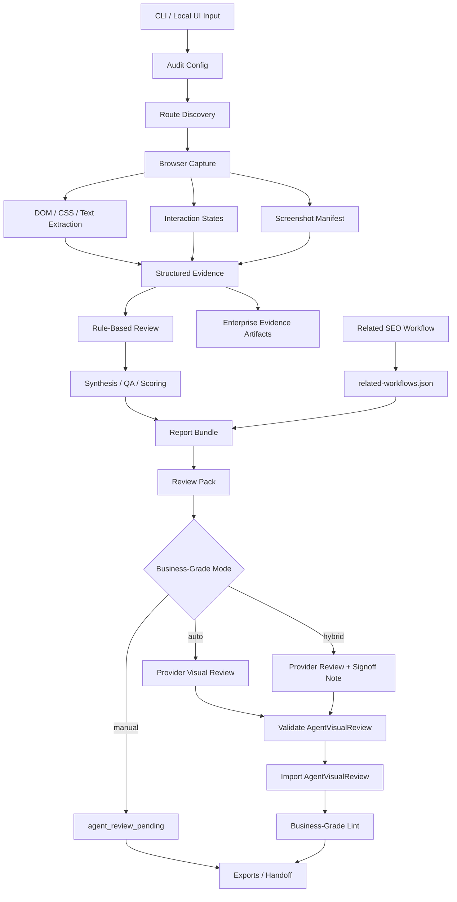

# Enterprise Local Architecture

> Local tracking artifact. Do not stage or commit this file unless explicitly requested.

## Architecture Principles

1. Evidence comes before conclusions. Every finding, score, recommendation, and business-grade claim must trace to captured or imported evidence.
2. Business-grade review is a gated state, not a marketing label. The gate passes only after validated visual review import.
3. Local-first artifacts are the product interface. Reports, JSON files, screenshots, review packs, exports, and checksums must be self-contained.
4. SEO remains a separate workflow. This repository may reference SEO artifacts but must not duplicate SEO analysis.
5. Enterprise readiness does not imply hosted SaaS, team collaboration, live integrations, or legal compliance certification.

## Target Data Flow



## Runtime Boundaries

| Layer | Owns | Must Not Own |
| --- | --- | --- |
| CLI | Argument parsing, closeout JSON, command orchestration, exit codes. | Provider-specific model logic, report rendering internals. |
| Core capture | Browser navigation, screenshots, DOM/CSS/text extraction, safe interactions, accessibility/performance basics. | Subjective design conclusions. |
| Core review | Deterministic findings, grouping, scoring, QA validation, actionability. | Unverified user behavior, revenue impact, legal certification. |
| Agent visual review | Multimodal subjective design judgment under strict schema. | Unknown screenshot references, unsupported analytics/SEO/compliance claims. |
| Report bundle | Stable artifact interface for humans and agents. | Scraping-only contracts or hidden transient state. |
| Export | Local package assembly, manifest, checksums, redaction. | Cloud upload or live third-party writes. |
| Related workflow seam | Metadata link to external audit artifacts. | Merging SEO findings into design findings. |

## Business-Grade Review Modes

| Mode | Behavior | Final State |
| --- | --- | --- |
| `auto` | Try provider-backed visual review when credentials exist. Generate, validate, import, run business-grade lint. | `business_grade` if imported and lint passes; otherwise `agent_review_pending` with provider error classification. |
| `manual` | Build review pack and instructions only. Do not call provider. | `agent_review_pending`. |
| `hybrid` | Try provider-backed visual review and keep explicit signoff metadata for stakeholders. | `business_grade` if imported and lint passes, plus signoff recommended; otherwise pending. |

Provider attempts must preserve:

- Attempted provider and model when known.
- Retry count and terminal status.
- Error class: `no_provider`, `provider_auth`, `provider_config`, `provider_timeout`, `provider_network`, `provider_schema`, `provider_validation`, or `unknown`.
- Raw output path when a response was received.
- Validation output path when validation ran.

## Enterprise Artifact Inventory

| File | Writer | Consumers |
| --- | --- | --- |
| `workflow-manifest.json` | Report bundle writer | Agents, local UI, exports. |
| `handoff.json` | Report bundle writer | Downstream implementation agents. |
| `quality-gate.json` | QA/scoring | Report, CI gates. |
| `business-grade-gate.json` | Business-grade linter/import | Report, CLI closeout, enterprise verify. |
| `screenshot-manifest.json` | Review pack builder | Agent visual review, report UI, screenshot coverage eval. |
| `agent-review-pack/review-pack-manifest.json` | Review pack builder | Multimodal agent review order. |
| `performance-audit.json` | Enterprise evidence writer | Report, enterprise verify, client appendix. |
| `accessibility-detail.json` | Enterprise evidence writer | Report, issue trail, accessibility caveats. |
| `privacy-tracking.json` | Enterprise evidence writer | Report, privacy/tracking caveats. |
| `resource-audit.json` | Enterprise evidence writer | Performance/resource recommendations. |
| `interaction-states.json` | Capture/review pack | Agent review and safe browser coverage. |
| `related-workflows.json` | Related workflow seam | Report, export, implementation handoff. |
| `enterprise-readiness.json` | Enterprise verifier/evidence writer | Release gates and closeout JSON. |
| `executive-summary.md` | Client deliverables writer | Client export and static report links. |
| `stakeholder-recommendations.md` | Client deliverables writer | Owner-ready action plan. |

## Related Workflow Contract

Related workflows are metadata references:

```json
{
  "schemaVersion": 1,
  "generatedAt": "2026-07-08T00:00:00.000Z",
  "workflows": [
    {
      "kind": "seo",
      "label": "SEO audit",
      "path": "/path/to/seo-audit",
      "status": "available",
      "score": 82,
      "manifestPath": "/path/to/seo-audit/workflow-manifest.json",
      "limitations": [
        "SEO findings are linked evidence only and are not merged into design findings."
      ]
    }
  ]
}
```

Supported initial kind:

- `seo`: Reference a local SEO workflow bundle by path.

Rejected behavior:

- Copying SEO findings into `findings.json`.
- Re-scoring the design audit using SEO scores.
- Claiming SEO checks were run by `design-review-workflow`.

## Failure Model

Every failed run or partial run should report:

| Class | Examples | Required Output |
| --- | --- | --- |
| `capture_navigation` | DNS failure, TLS failure, blocked navigation. | URL, page candidate, retry count, screenshot status. |
| `capture_timeout` | Render readiness timeout, screenshot timeout. | Step, timeout value, partial evidence path. |
| `provider_unavailable` | No credentials, unsupported provider. | Pending state and manual fallback instructions. |
| `provider_invalid_output` | JSON parse failure, schema mismatch. | Raw output path and validation errors. |
| `business_gate_failed` | Unknown screenshot, TODO text, unsupported claim. | Gate JSON and actionable reasons. |
| `export_failed` | File copy/checksum failure. | Export profile, path, cleanup status. |
| `related_workflow_unreadable` | Missing SEO path or unsupported artifact shape. | Warning in `related-workflows.json`, no design audit failure unless strict mode asks for it. |

## Privacy And Retention

Default posture:

- Keep raw local audit artifacts for inspection.
- Redact local absolute paths in repo-import exports.
- Do not submit forms with real data.
- Do not capture login-protected or purchase-completion flows unless explicit sandbox credentials and non-production data are configured.
- Store provider payloads locally under the audit folder when provider review runs.

Future retention controls:

```yaml
retention:
  screenshots: keep
  providerPayloads: keep
  exports: keep
  redactLocalPathsInExports: true
  redactCookiesInReports: true
```

## Verification Architecture

Enterprise verification runs in layers:

1. Type and unit checks: `npm run typecheck`, `npm test`.
2. Build checks: `npm run build`.
3. Environment checks: `npm run doctor`.
4. Bundle checks: `report lint --strict`.
5. Business-grade checks: `business-grade lint --report <audit-dir>` when business-grade is claimed.
6. Enterprise artifact checks: `enterprise verify --report <audit-dir>`.
7. Export checks: `export --profile review|full|repo-import` plus checksums.
8. Compare checks when baseline exists: `compare <baseline> <candidate>`.

## Implementation Quality Rules

- Add schema fields before writing artifacts that depend on them.
- Store machine-readable state in JSON; Markdown is for humans only.
- Keep raw screenshot files immutable.
- Treat provider output as untrusted input until schema and business-grade validation pass.
- Keep generated report paths stable; downstream agents consume them directly.
- Prefer additive artifacts over breaking existing report consumers.
- Do not hard-code model names in business logic.
- Tests must cover no-provider and failure states, not only successful provider output.
